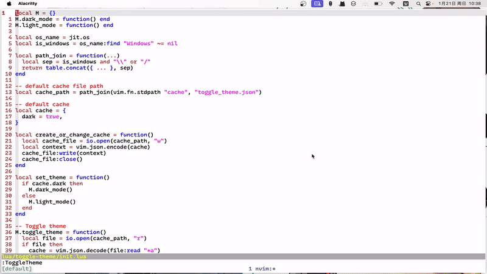
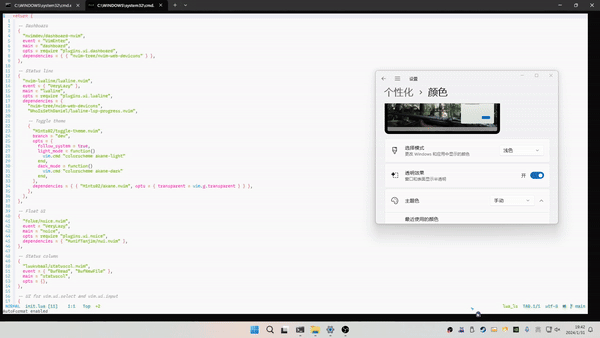

# toggle-theme.nvim

A neovim plugin for toggle theme

## Install

```lua
-- lazy.nvim
require("lazy").setup({
  {
    "M1nts02/toggle-theme.nvim",
    event = "UIEnter",
    opts = {
      light_mode = function()
        vim.cmd "colorscheme zellner"
      end,
      dark_mode = function()
        vim.cmd "colorscheme habamax"
      end,
    },
  },
})
```

## Configuration

```lua
-- default config
{
  following_system = false, -- Only support macos and windows10
  start_only = false, -- Starting only
  waiting_time = 2000,
  light_mode = function()
  end,
  dark_mode = function()
  end,
}
```

## Configuration with [hydra](https://github.com/anuvyklack/hydra.nvim)
```lua
require("lazy").setup({
  {
    "M1nts02/toggle-theme.nvim",
    event = "UIEnter",
    opts = {
      light_mode = function()
        vim.cmd "colorscheme zellner"
      end,
      dark_mode = function()
        vim.cmd "colorscheme habamax"
      end,
    },
  },
  { -- Hydra
    "anuvyklack/hydra.nvim",
    config = function()
      local Hydra = require "hydra"
      Hydra {
        name = "Options",
        hint = [[
    ^ ^                   OPTIONS
    ^
    _t_ %{get_dark_mode} Dark mode

    ^
         ^^^^                _<Esc>_
                                                           ]],
        config = {
          color = "amaranth",
          invoke_on_body = true,
          hint = {
            border = "single",
            position = "middle",
            funcs = {
              ["get_dark_mode"] = function()
                local dark_mode = require("toggle-theme").get_dark_mode()
                if dark_mode then
                  return "[x]"
                else
                  return "[ ]"
                end
              end,
            },
          },
        },
        mode = "n",
        body = "\\",
        heads = {
          {
            "t",
            function()
              vim.cmd "ToggleTheme"
            end,
            { desc = "Toggle dark mode" },
          },
        },
      }
    end,
  },
})
```

## Usage

### Not following system
```vim
:ToggleTheme
```



### Following system


